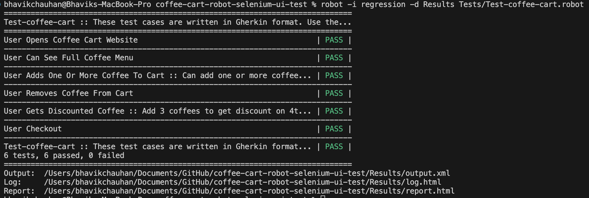

# Web automation testing project using [Robot framework](https://robotframework.org/) and [Selenium](https://www.selenium.dev/)

### Test site used for this project: [coffee-cart app](https://coffee-cart.app/).

#### Libraries used for testing

* [**BuiltIn**](https://robotframework.org/robotframework/latest/libraries/BuiltIn.html)
    * Bundled with the framework
    * Provides a set of often needed generic keywords.
* [**Selenium Library**](https://github.com/robotframework/SeleniumLibrary/)
    * Web testing library that uses popular Selenium tool internally.
* [**JSON Library**](https://robotframework-thailand.github.io/robotframework-jsonlibrary/JSONLibrary.html)
    * Robotframework testlibrary for manipulating JSON object (dictionary)
* [**Collections**](https://robotframework.org/robotframework/latest/libraries/Collections.html)
    * Bundled with the framework
    * Provides a set of keywords for handling Python lists and dictionaries.
* [**Requests Library**](https://docs.robotframework.org/docs/different_libraries/requests)
    * To provide HTTP api testing functionalities 

## Instructions to install framework and libraries (on Linux)

**Precondition: [Install Python](https://robotframework.org/robotframework/latest/RobotFrameworkUserGuide.html#python-installation)**

**Install Robotframework**

```
#Install and upgrade robotframework
pip install --upgrade robotframework
```

If Libraries are missing, install using pip
```

#Install Json library
pip install -U robotframework-jsonlibrary
```

```
#Install Requests Library
pip install robotframework-requests
```

If need to upgrade Selenium Library

```
pip install --upgrade robotframework-seleniumlibrary
```

**Install Google Chrome and ChromeDriver**

Download chrome and chromedriver from [chrome-for-testing](https://googlechromelabs.github.io/chrome-for-testing/).

**Note:** ChromeDriver needed for Selenium WebDriver to control Chrome. *Ensure versions of chrome and chrome divers match.*

## How to run tests

On terminal, navigate to the project directory. Use the following command to run tests:
```
#Run all tests in Test folder
robot -d Results Tests/Test-coffee-cart.robot

#Run specific tests using tags
robot -i <tag-for-specific-test-cast> -d Results Tests/Test-coffee-cart.robot

Example:
robot -i discount -d Results Tests/Test-coffee-cart.robot

```

## Test result

